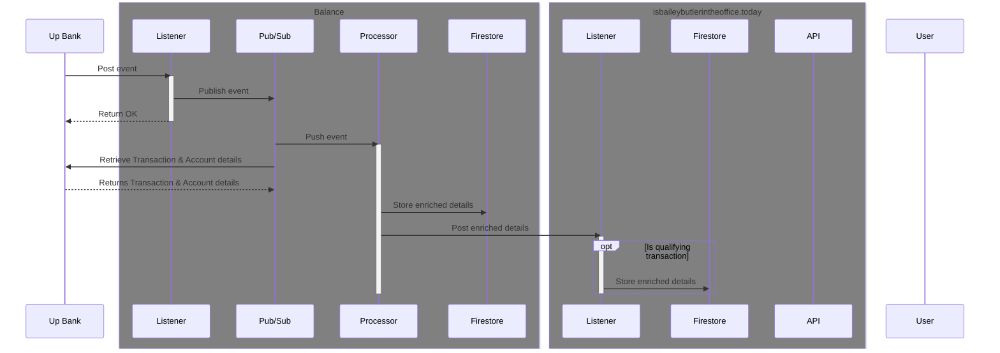
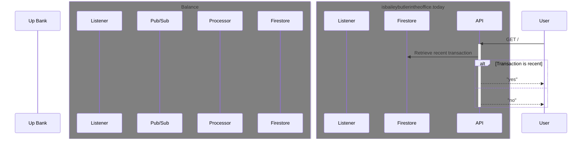

# [isbaileybutlerintheoffice.today](https://isbaileybutlerintheoffice.today)?

---

Service to consume banking transaction data from my [balance project](https://github.com/baely/balance).

Transaction criteria for determining office presence:
 - Transaction amount is between $4.00 and $7.00
 - ~~Transaction time is between 6:00am and 12:00pm~~
 - Transaction is on a weekday
 - Transaction is not a foreign transaction
 - Transaction is categorised as "Restaurants and Cafes"

If the latest transaction matching those criteria is less than 12 hours old, then I am assumed to be in the office on that day.

### Sequence Diagrams

Storing valid transaction data

Presenting office presence

